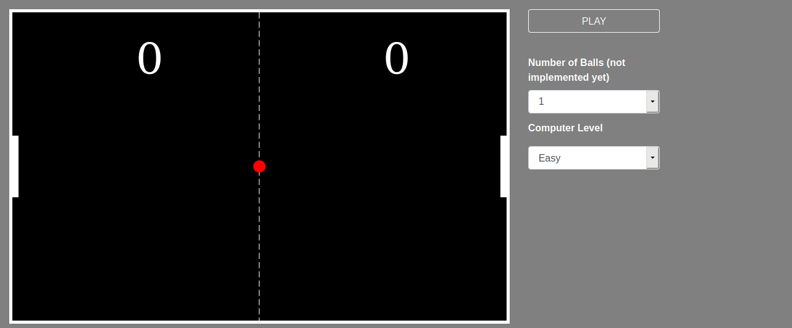

# Simple ping pong game :tennis:
---

Built with vanilla javascript: [Play Here!](https://ping-pong-game.netlify.com/)

Based on [this](https://www.youtube.com/watch?v=nl0KXCa5pJk&list=PLt4757glfbhHkfz7dqojMbnBdgUnFih4B&t=0s&index=2) tutorial.

---

The following improvements made:

* Split code into separate web components
* Setup babel for transpiling/compiling
* Setup webpack for bundling
* Added control buttons
* Added difficulty level selection

To-dos:

* Multiple balls
